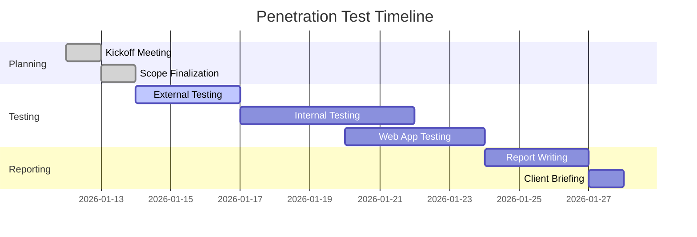

# 🎯 Engagement Overview: <%tp.file.title%>

**Client:** <%tp.system.prompt("Client Name")%>
**Engagement Type:** `engagement_type`
**Date Range:** `start_date` to `end_date`
**Lead Assessor:** Kal

---

## 📋 Executive Summary

[High-level overview of the engagement scope and objectives]

---

## 🎯 Scope & Objectives

### In-Scope Systems
- **External:** 
- **Internal:** 
- **Web Applications:** 
- **APIs:** 
- **Cloud Infrastructure:** 

### Out-of-Scope
- 
- 

### Testing Objectives
1. 
2. 
3. 

---

## 📅 Engagement Timeline



---

## 🧪 Testing Progress

### Phase Status Overview

```dataview
TABLE
  choice(status = "🟢", "✅ Complete", choice(status = "🟡", "⏳ In Progress", choice(status = "🔴", "🔴 Blocked", "🔵 Not Started"))) as "Status",
  completion as "Progress",
  start_date as "Started",
  end_date as "Completed"
FROM "Company/Engagements/<%tp.file.title%>"
WHERE contains(file.name, "TPL_") AND test_type
SORT file.name ASC
```

### Testing Phases

#### 🌐 Phase 1: External Network Testing
**Status:** 🔵 Not Started | 🟡 In Progress | 🟢 Complete | 🔴 Blocked
**Document:** [[01_External/TPL_External_Pentest]]
**Focus Areas:**
- External attack surface mapping
- Perimeter vulnerability assessment
- VPN and remote access security
- SSL/TLS configuration
- External firewall rules

#### 🏢 Phase 2: Internal Network Testing
**Status:** 🔵 Not Started | 🟡 In Progress | 🟢 Complete | 🔴 Blocked
**Document:** [[02_Internal/TPL_Internal_Pentest]]
**Focus Areas:**
- Active Directory security
- Lateral movement potential
- Privilege escalation vectors
- Network segmentation
- Container/Kubernetes security (if applicable)

#### 🌐 Phase 3: Web Application Testing
**Status:** 🔵 Not Started | 🟡 In Progress | 🟢 Complete | 🔴 Blocked
**Document:** [[02_WebApp/TPL_WebApp_Pentest]]
**Focus Areas:**
- OWASP Top 10 vulnerabilities
- Authentication and session management
- Authorization and access control
- Input validation
- API security

---

## 🔍 Findings Overview

### Findings by Severity

```dataview
TABLE
  finding_id as "ID",
  file.link as "Title",
  severity as "Severity",
  test_phase as "Phase",
  status as "Status"
FROM "Company/Engagements/<%tp.file.title%>"
WHERE contains(file.name, "Finding")
SORT severity DESC
```

### Statistics

```dataview
TABLE WITHOUT ID
  length(filter(rows, (r) => r.severity = "Critical")) as "Critical",
  length(filter(rows, (r) => r.severity = "High")) as "High",
  length(filter(rows, (r) => r.severity = "Medium")) as "Medium",
  length(filter(rows, (r) => r.severity = "Low")) as "Low",
  length(filter(rows, (r) => r.severity = "Informational")) as "Info"
FROM "Company/Engagements/<%tp.file.title%>"
WHERE contains(file.name, "Finding")
GROUP BY "Total"
```

---

## 📊 Risk Dashboard

### Open Findings by Phase

```dataview
TABLE WITHOUT ID
  test_phase as "Phase",
  length(filter(rows, (r) => r.status = "Open")) as "Open",
  length(filter(rows, (r) => r.status = "In Remediation")) as "In Remediation",
  length(filter(rows, (r) => r.status = "Closed")) as "Closed"
FROM "Company/Engagements/<%tp.file.title%>"
WHERE contains(file.name, "Finding")
GROUP BY test_phase
```

### High-Risk Findings

```dataview
TABLE
  finding_id as "ID",
  file.link as "Finding",
  affected_systems as "Affected Systems",
  status as "Status"
FROM "Company/Engagements/<%tp.file.title%>"
WHERE contains(file.name, "Finding") AND (severity = "Critical" OR severity = "High")
SORT severity DESC
```

---

## 📝 Daily Notes

### <%tp.date.now("YYYY-MM-DD")%> - Day [X]
**Activities:**
- 

**Findings:**
- 

**Blockers:**
- 

**Tomorrow's Plan:**
- 

---

## 🔗 Quick Links

### Testing Documents
- [[01_External/TPL_External_Pentest|External Testing]]
- [[02_Internal/TPL_Internal_Pentest|Internal Testing]]
- [[02_WebApp/TPL_WebApp_Pentest|WebApp Testing]]

### Templates
- [[z_Templates/TPL_Finding|New Finding Template]]
- [[z_Templates/TPL_External_Pentest|External Template]]
- [[z_Templates/TPL_Internal_Pentest|Internal Template]]
- [[z_Templates/TPL_WebApp_Pentest|WebApp Template]]

### Reports
- [[Draft_Report]]
- [[Final_Report]]
- [[Executive_Summary]]

---

## 📞 Engagement Contacts

### Client Team
| Name | Role | Email | Phone |
|------|------|-------|-------|
|      |      |       |       |

### Your Team
| Name | Role | Email |
|------|------|-------|
| [Your Name]  | Lead Assessor | |

---

## 🔐 Credentials & Access

### VPN Access
```text
Server: 
Username: 
```

### Test Accounts
| System | Username | Password | Role | Notes |
|--------|----------|----------|------|-------|
|        |          |          |      |       |

**Note:** Store actual passwords in password manager, not in Obsidian.

---

## 🛠️ Tools & Environment

### Testing Infrastructure
- **Jump Box IP:** 
- **Testing Subnet:** 
- **VPN Concentrator:** 

### Required Tools
- [x] Kali Linux VM
- [x] Burp Suite Professional
- [x] Nessus Professional
- [ ] Additional tools...

---

## 📋 Deliverables Checklist

- [ ] External Penetration Test
- [ ] Internal Penetration Test
- [ ] Web Application Penetration Test
- [ ] Draft Report
- [ ] Final Report
- [ ] Executive Presentation
- [ ] Remediation Verification (if applicable)

---

## 📅 Meeting Notes

### Kickoff Meeting - <%tp.date.now("YYYY-MM-DD")%>
**Attendees:**
- 

**Discussion:**
- 

**Action Items:**
- 

---

### Weekly Status - [Date]
**Progress Update:**
- 

**New Findings:**
- 

**Next Steps:**
- 

---

## 🏁 Engagement Closeout

### Final Statistics
- **Total Findings:** 
- **Critical:** 
- **High:** 
- **Medium:** 
- **Low:** 
- **Informational:** 

### Lessons Learned
- 

### Follow-up Actions
- 

---

## 📸 Screenshot Naming Convention
All screenshots should follow this format:
`[PHASE]_[SECTION-ID]_[BRIEF-DESC]_[TIMESTAMP]`

Examples:
- `EXT_VUL-01_nmap-results_20260112-1430`
- `INT_EXP-02_lateral-movement_20260112-1530`
- `WEB_LOG-01_idor-test_20260112-1630`
